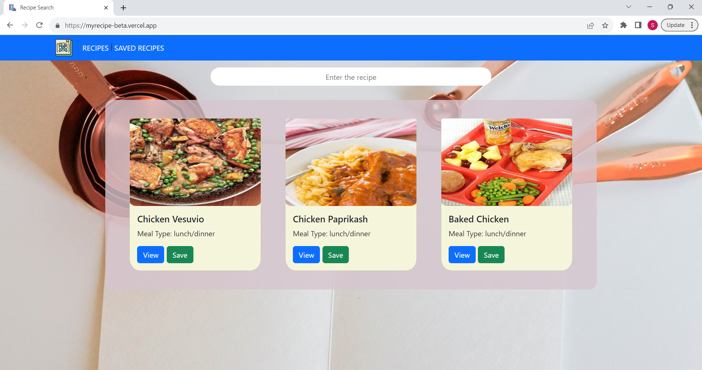
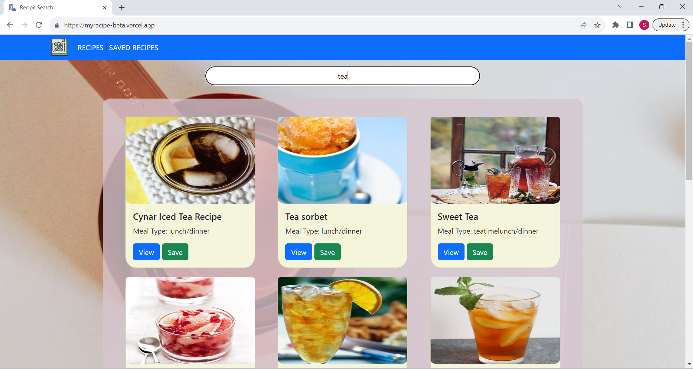
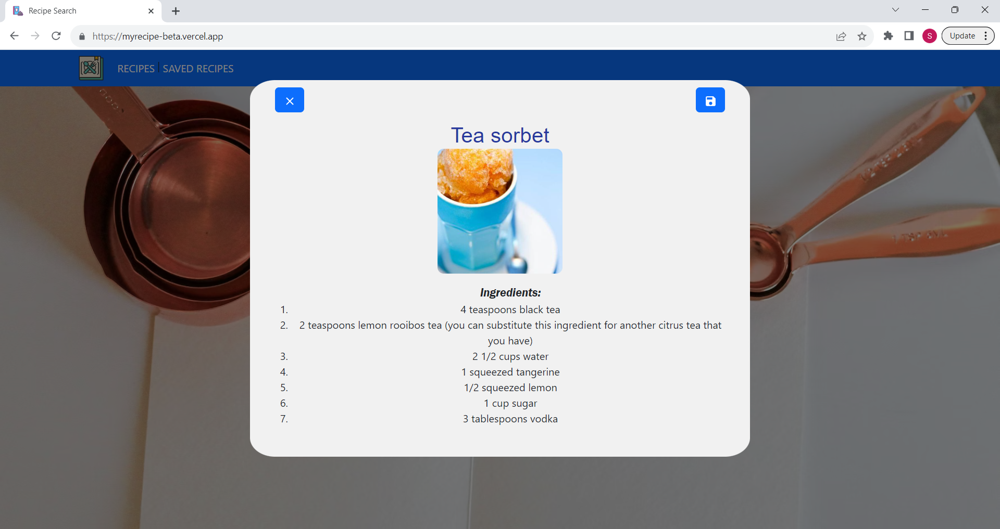
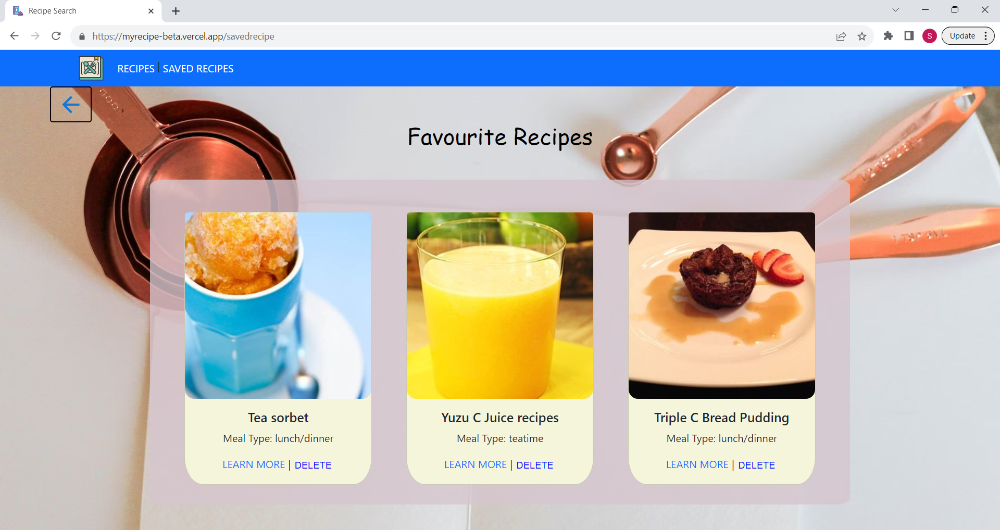
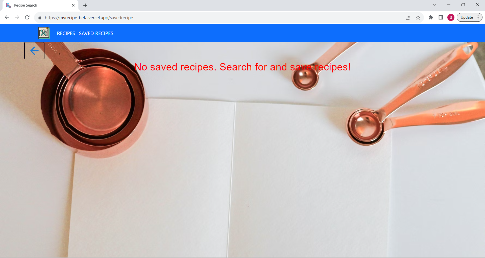

# Recipe Search Web App

This is a simple web application that allows users to search for recipes based on their query and save their favorite recipes.

## Table of Contents

- [Features](#features)
- [Getting Started](#getting-started)
- [Usage](#usage)
- [Technologies Used](#technologies-used)


## Features

- Search for recipes based on a query.
- View recipe details including ingredients and images.
- Save your favorite recipes.
- Prevent saving the same recipe multiple times.
- Inform users when a recipe is already saved.
- Responsive design for various screen sizes.

## Getting Started

To get a copy of this project up and running on your local machine, follow these steps:

1. **Clone the repository**:

   ```bash
   git clone https://github.com/your-username/recipe-search-web-app.git

   ```

2. Install Dependencies

```bash

    npm install

```

3. Run the Application

```bash

    npm run dev

```
## Usage

1. Enter your recipe query in the search bar and press "Enter" or click the search icon.
2. View the list of recipes, and click the "View" button to see recipe details in a modal.
3. Inside the modal, click the "Save" button to save the recipe.
4. If the recipe is already saved, you will be alerted that it's already in your saved recipes.

## Technologies Used

1. React: A JavaScript library for building user interfaces.
2. Material-UI: A popular React UI framework.
3. React Bootstrap: A library for using Bootstrap components in React applications.

## Screenshots




